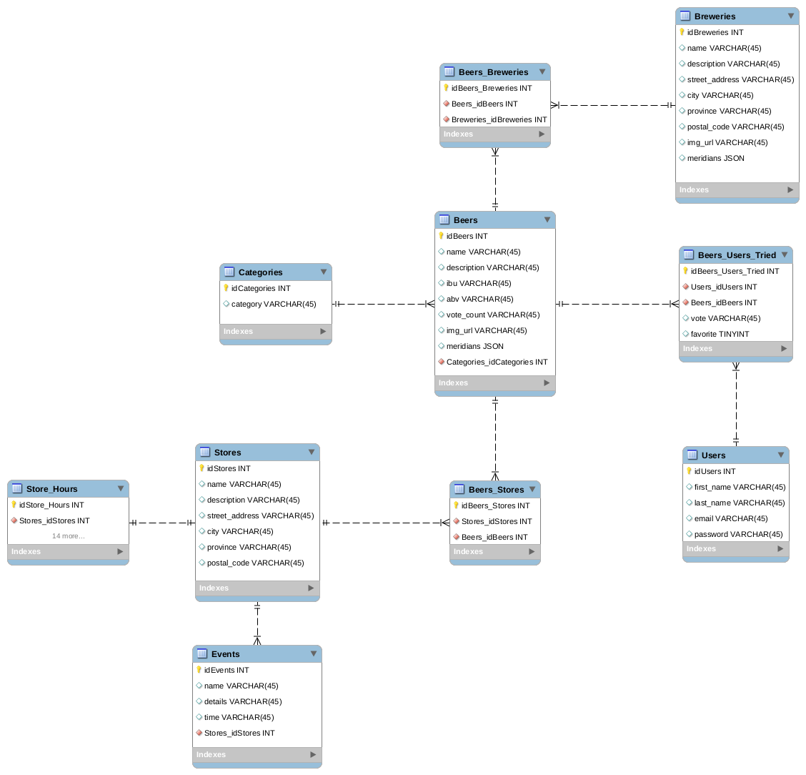

# NuBrew (Craft Beer Application - React Native)

NuBrew is an application that allows users to vote on their craft beer drinks and keep track of favorited drinks over time. As users expand their set of craft beers tried over time, the application will provide recommendations based on their previous likes based on IBU and category/style of drink. Of course, users need to be able to take that plunge and explore uncharted territories by trying something new by random as well, even if they really don't like that one style, taste changes over time!

We want to make it as easy as possible, so for those that bought their drinks with labels, the application was created while experimenting machine learning and label recognition using Google AutoML Vision.

# Contributors

 - @arromeo
 - @bert-bae

# Tech Stack

1. React-Native (Mobile)
2. React-native-camera (module)
3. PSQL
4. Knex
5. NodeJS
6. Express
7. Google AutoML Vision (Machine Learning)

# Dependencies

## Root Folder
 - "@expo/samples": "2.1.1",
 - "@google-cloud/automl": "^0.1.3",
 - "body-parser": "^1.18.3",
 - "expo": "^31.0.2",
 - "install": "^0.12.2",
 - "pg": "^7.7.1",
 - "react": "16.5.0",
 - "react-native": "https://github.com/expo/react-native/archive/sdk-31.0.0.tar.gz",
 - "react-native-elements": "^0.19.1",
 - "react-navigation": "^2.18.2"

## Server Folder
 - "nodemon": "^1.18.9",
 - "express": "^4.16.4"

# Demo

Images and/or videos go here

# To get started

Please note that we unfortunately cannot provide access to the camera functionality as it requires the Google AutoML Vision API. There is a demo of it above for your reference to see how it works!

1. Fork and clone the repository.
2. Install the dependencies in the root folder.
3. Go to the server file and install the dependencies.
4. If you do not have an SDK Manager or other android simulator installed, you can set it up following the instructions provide by Expo: <https://docs.expo.io/versions/latest/workflow/android-studio-emulator>. If you would rather use an android phone, set the phone to developer mode
  - Go to settings.
  - Open "About Phone".
  - Tap the section "Build" 7 times.
  - Phone should notify you that it is now available for developer mode.
  - Connect a USB and install the Expo Application.
5. Open your terminal in linux (instructions for windows may be different).
6. Run "ifconfig" to locate your WIFI IP address (both laptop and phone need to be connected to the name network).
```js
Will look something like this
...
inet 192.168.0.15 ...
...
```
7. Create a "dev_port.json" file and enter the following object into the file:
```js
{
  "DEV_PORT": "http://[YourIPAddress]:5000",
}

example:
{
  "DEV_PORT": "http://http://192.168.0.15:5000",
}
```
8. Go to the server folder and run "npm run server" (this will start your server for the React Native application to make API calls to).
9. If using the phone, unlock your phone screen. With the simulator, ensure the program is open and running.
10. In a second terminal in the root folder, run "npm run android".
11. Ta Da! Your app should now be automatically loading on your phone or android simulator.

## Google API Set-up

Dependency: "@google-cloud/automl": "^0.1.3" (REQUIRED)

AutoML Vision API code is located in folder ~/server/automlvision.js .

AutoML account is required (unless developers set it up with a service key to the current auto ML vision module that is currently trained).

Credentials need to be passed through the './server/server.js' file through a hidden ENV folder. Specific information required are:
  - "PROJECT_ID": "xxxxxx",
  - "COMPUTE_REGION": "xxxxxx",
  - "MODEL_ID": "xxxxxx",

To gain access to the API, you also need to do the following in your terminal (Linux):
  - "export GOOGLE_APPLICATION_CRENDENTIALS="[path to the service key]"
    - To verify that it has been entered correctly:
      - echo $GOOGLE_APPLICATION_CREDENTIALS
  - "export PROJECT_ID="[google project id goes here]"
    - To verify that it has been entered correctly:
        - echo $PROJECT_ID

Information on Creating Service Account Keys
<https://cloud.google.com/iam/docs/creating-managing-service-account-keys#prerequisites_for_this_guide>

Quick start information on vision AutoML API
<https://cloud.google.com/vision/automl/docs/quickstart>

# During the creation phase

Here is our project planning journey. To see the wireframes and ERD created during the initial phases of the project, go to the "docs" folder.

## Universal Values

1. Save time
2. Feel good
3. Look good
4. Not save money because beer gets expensive

## User Story

1. As a user, I want to be able to keep track of my favorite beers/least favorite beers.
2. As a user, I'd like to be recommended beers based on my favorites (single or flights).
3. As a user, I'd like to be recommended beers based on the community's favorites (single or flights).
4. As a user, I'd like the option to try new beers that I've never tried before. 
5. As a user, I'd like to be recommended beers in an establishment/store based on personal/community favorites.
6. As a user, I'd like an email if a new product hits the market that meets the requirements set by my favorites (feature).
7. As a user, I'd like to be able to take a photo of a beer label to enter it into my favorites [recommendations/voting prompts/favorites].
8. As a user, I'd like to be able to search by text the drink for [recommendations/voting prompts/favorites].
9. As a user, I'd like to be recommended locations via map based on personal/community favorites (FEATURE).

## Routes

From Index
1. We should see the details of nearby events with an image

  - Data Required:
    1. Events Table

2. The top community beer (image and name)
  A. Clicking brings up details page on that particular beer.

  - Data Required:
    1. Beers table LIMIT 1

3. Get recommendation button
  A. Displays a list of recommended beers that have yet to be tried.
  B. Same as 6Ba.

  - Data Required:
    1. Beers Table
    
4. Search button in bottom nav to prompt a search
  A. A text field to enter in search terms.
  B. A button to search via photo
    a. The camera screen pops up with a photo button on bottom
    b. Back button in the upper left.
  C. Option to search by beer, store, or possibly brewery
    a. Beer search would bring up list of stores

    - Data Required:
      1. Beers Table and Beers_Stores Table

    b. Store search would bring up recommendations based off of store inventory

    - Data Required:
      1. Beers Table and Beers_Stores Table

    c. Brewery will bring up a list of stores?

    - Data Required:
      1. Beers_Brewery Table and join with store table

5. Rate your drink to prompt a vote
  A. A text field to search by name
  B. A camera icon button below to search by photo of bottle.
    a. Based off of the search, it displays a stored picture of the bottle, name and brewery.

    -Data Required:
      1. Beers_brewery, beers
      2. POST - Users & beers_users_tried

    b. If search unsuccessful, redirects back to search.

    -Data Required:
      1. Beers_brewery, beers

    c. If search has more than one result, prompt for user clarification.

    -Data Required:
      1. Beers_brewery, beers
      2. POST - Users & beers_users_tried

6. Favorites button to get the previously favorited drink.
  A. Quick search to filter results.
  B. Displays a list of previously favorited beers.
    - Data Required:
      1. beers_users_tried, beers

    a. Clicking the beer opens a details page that will display buttons to find.

    - Data Required:
      1. beers

      aa. Each line would have an option to remove.

        - Data Required:
          1. beers_users_tried

7. Profile button to log in/log out/view profile.
  A. If not logged in it prompts for credentials
  B. If logged in displays brief user profile
  C. Log out button near bottom.

  - Data Required:
    1. users

## Business User Story (feature - Not implemented)

1. As a business, I'd like to send notifications if a new product is released.
2. As a business, I'd like to track the community's favorites.
3. As a business, I'd like to host events and invite community members.

## ERD


